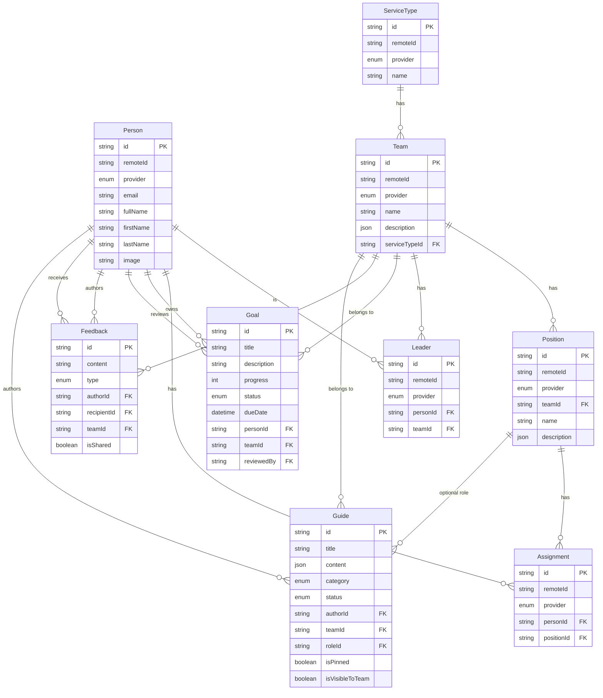

# feat: My Team Full App Build

## Overview

Build the complete My Team church volunteer team management app — a Turborepo monorepo with a Next.js 16 web app, tRPC v11 API, Prisma 7 + PostgreSQL, Auth.js v5 (PCO OAuth), pg-boss background sync, and Tiptap rich text editing. The architecture supports a future React Native/Expo mobile app consuming the same tRPC API.

Key decisions carried forward from origin document (see origin: `docs/brainstorms/2026-03-20-my-team-full-app-requirements.md`):
- tRPC over GraphQL for end-to-end TypeScript type safety
- Turborepo monorepo for shared API/types across future mobile app
- Auth.js v5 with JWT strategy for web + future mobile compatibility
- Tiptap for rich text (JSON content portable to mobile)
- Railway deployment (web + worker + Postgres + bucket)
- PCO sync ported from EvChurch/changelog via pg-boss

## Problem Statement

Church volunteer team leaders need tools for goal-tracking, feedback, and knowledge sharing that Planning Center Online doesn't provide. My Team reads PCO data (teams, members, roles) and layers on Goals, Feedback, and Guides as app-native features with full CRUD.

## Technical Approach

### Architecture

```
my-team/
├── apps/
│   ├── web/                    # Next.js 16 (App Router, Turbopack)
│   └── worker/                 # Standalone pg-boss worker process
├── packages/
│   ├── api/                    # tRPC v11 router + Prisma 7 client
│   ├── auth/                   # Auth.js v5 + PCO OIDC provider
│   ├── jobs/                   # pg-boss queue definitions + sync logic
│   ├── shared/                 # Zod schemas, types, constants, design tokens
│   ├── typescript-config/      # Shared tsconfig bases
│   └── eslint-config/          # Shared ESLint configs
├── turbo.json
├── pnpm-workspace.yaml
└── package.json
```

**Internal packages export `.ts` source directly** — no build step needed. Next.js 16 transpiles them via Turbopack. Each package uses the `exports` field in `package.json`.

### Data Model (ERD)



### Implementation Phases

---

#### Phase 1: Monorepo Foundation + Data Layer

Convert the flat Next.js project into a Turborepo monorepo, set up Prisma schema, and port the PCO sync.

##### 1.1 Turborepo Scaffold

- [ ] Create root `pnpm-workspace.yaml` with `apps/*` and `packages/*`
- [ ] Create root `turbo.json` with `tasks` config (build, dev, lint, type-check)
- [ ] Create root `package.json` with turbo scripts and `packageManager` field
- [ ] Move existing Next.js files into `apps/web/`
- [ ] Update `apps/web/tsconfig.json` path aliases (`@/*` → `./src/*`)
- [ ] Create `packages/typescript-config/` with `base.json`, `nextjs.json`, `library.json`
- [ ] Create `packages/eslint-config/` with shared ESLint flat config
- [ ] Verify `pnpm dev` starts the web app from root

**Files:**
- `pnpm-workspace.yaml`
- `turbo.json`
- `package.json` (root)
- `apps/web/package.json`
- `apps/web/tsconfig.json`
- `packages/typescript-config/base.json`
- `packages/typescript-config/nextjs.json`
- `packages/typescript-config/library.json`
- `packages/eslint-config/package.json`

##### 1.2 Shared Packages Setup

- [ ] Create `packages/shared/` — Zod schemas, design token constants, type exports
  - `packages/shared/src/index.ts`
  - `packages/shared/src/env.ts` — type-safe env validation via `@t3-oss/env-nextjs` (port from changelog's `lib/env.ts`, add `experimental__runtimeEnv` for modern Next.js)
  - `packages/shared/package.json` with `exports` field

##### 1.3 Database Package (packages/api)

- [ ] Create `packages/api/` with Prisma 7 schema
- [ ] Port PCO-synced models from changelog schema: Person, ServiceType, Team, Position, Assignment, Leader (with `remoteId` + `provider` composite keys)
- [ ] Add app-native models from MEGA_PROMPT spec: Goal (with `GoalStatus` enum), Feedback (with `FeedbackType` enum), Guide (with `GuideCategory`, `GuideStatus` enums)
- [ ] Configure Prisma 7 with `@prisma/adapter-pg` driver adapter (mandatory in v7)
- [ ] Set generator provider to `"prisma-client"` (v7 change from `"prisma-client-js"`)
- [ ] Create `prisma.config.ts` with output to `generated/prisma/client`
- [ ] Create singleton Prisma client with `PrismaPg` adapter and `$extends` for computed fields (port `descriptionMarkdown` from changelog's `lib/db.ts`)
- [ ] Add global Prisma singleton pattern for dev hot-reload

**Files:**
- `packages/api/prisma/schema.prisma`
- `packages/api/prisma.config.ts`
- `packages/api/src/db.ts`
- `packages/api/package.json`

**Key schema note:** The Guide model stores `content` as `Json` (Tiptap JSON). The `description` fields on Team and Position are also `Json` (from PCO, can contain markdown).

##### 1.4 PCO Sync (packages/jobs)

- [ ] Create `packages/jobs/` for pg-boss queue definitions
- [ ] Port `lib/pco.ts` from changelog → `packages/jobs/src/pco.ts` (PCO API client with Jsona, Zod validation, `fetchTeamsSnapshot()`)
- [ ] Port `lib/pg-boss.ts` → `packages/jobs/src/boss.ts` (singleton factory)
- [ ] Port `lib/jobs/sync-pco/` → `packages/jobs/src/sync-pco/` (job handler + worker setup)
- [ ] Update all imports to use `@repo/api` for Prisma client and `@repo/shared` for env
- [ ] **Enhancement:** Add `image` field to Person fetch (PCO provides avatar URLs — needed for UI)
- [ ] Create `apps/worker/` — standalone entry point that starts pg-boss and registers workers
- [ ] Add `apps/worker/package.json` with `tsup` build and `tsx` dev scripts

**Files:**
- `packages/jobs/src/pco.ts`
- `packages/jobs/src/boss.ts`
- `packages/jobs/src/sync-pco/index.ts`
- `packages/jobs/src/sync-pco/job.ts`
- `packages/jobs/package.json`
- `apps/worker/src/index.ts`
- `apps/worker/package.json`
- `apps/worker/tsconfig.json`

**Dependencies to install:** `pg-boss`, `jsona`, `zod` (in packages/jobs)

---

#### Phase 2: Auth + tRPC API Layer

##### 2.1 Auth.js v5 (packages/auth)

- [ ] Create `packages/auth/` with Auth.js v5 configuration
- [ ] Create custom PCO OIDC provider using `type: "oidc"` with issuer `https://api.planningcenteronline.com` (PCO supports OIDC discovery as of Sept 2025)
- [ ] Configure scopes: `openid people services`
- [ ] JWT session strategy with 30-day max age (matches changelog pattern)
- [ ] JWT callback: persist PCO `sub` as `pcoId`, store access token for potential future use
- [ ] Session callback: expose `pcoId` on session user
- [ ] Export `{ auth, handlers, signIn, signOut }` from `NextAuth()`
- [ ] Create route handler at `apps/web/app/api/auth/[...nextauth]/route.ts`
- [ ] Create `apps/web/proxy.ts` for Next.js 16 session middleware (replaces `middleware.ts`)
- [ ] **Link PCO user to Person:** On first sign-in, look up `Person` by PCO `remoteId` matching the session `pcoId`. If not found (PCO user not yet synced), trigger an immediate sync or show "account not ready" state.

**Files:**
- `packages/auth/src/index.ts`
- `packages/auth/src/planning-center.ts`
- `packages/auth/package.json`
- `apps/web/app/api/auth/[...nextauth]/route.ts`
- `apps/web/proxy.ts`

**Auth.js v5 critical notes:**
- Use `next-auth@beta` (or `next-auth@5` if stable tag available)
- v5 uses `auth()` instead of `getServerSession()` — no need to pass `authOptions`
- Next.js 16 uses `proxy.ts` (not `middleware.ts`) for session proxy
- `AUTH_SECRET` env var is required (replaces `NEXTAUTH_SECRET`)

##### 2.2 tRPC v11 Router (packages/api)

- [ ] Initialize tRPC v11 with context that calls `auth()` from `@repo/auth`
- [ ] Create base procedures: `baseProcedure` (public), `protectedProcedure` (requires session), `leaderProcedure` (requires leader role for given team)
- [ ] Create tRPC routers:

**Teams router** (`packages/api/src/routers/teams.ts`):
- `teams.list` — all teams for current user (via Assignment/Leader joins)
- `teams.get` — single team with members, positions, leaders, goals, feedback, guides

**Goals router** (`packages/api/src/routers/goals.ts`):
- `goals.list` — filter by teamId, personId, status
- `goals.pending` — pending goals for a team (leader view)
- `goals.create` — create goal (any member)
- `goals.updateStatus` — approve/decline (leader only)
- `goals.updateProgress` — update progress 0-100 (goal owner)

**Feedback router** (`packages/api/src/routers/feedback.ts`):
- `feedback.list` — filter by teamId, recipientId
- `feedback.create` — create feedback (leader only)

**Guides router** (`packages/api/src/routers/guides.ts`):
- `guides.list` — filter by teamId, roleId, category
- `guides.get` — single guide with full content
- `guides.create` — create guide (leader only)
- `guides.update` — update guide (leader only)
- `guides.publish` — publish draft (leader only)
- `guides.delete` — delete guide (leader only)

**People router** (`packages/api/src/routers/people.ts`):
- `people.me` — current user's Person record with teams, roles, leader status

- [ ] Create server-side caller using `createTRPCOptionsProxy` (v11 pattern for Server Components)
- [ ] Create client-side provider using `createTRPCContext` from `@trpc/tanstack-react-query`
- [ ] Create shared `makeQueryClient` factory
- [ ] Set up API route handler at `apps/web/app/api/trpc/[trpc]/route.ts`

**Files:**
- `packages/api/src/init.ts` — tRPC initialization, context, base procedures
- `packages/api/src/routers/_app.ts` — root router merging all sub-routers
- `packages/api/src/routers/teams.ts`
- `packages/api/src/routers/goals.ts`
- `packages/api/src/routers/feedback.ts`
- `packages/api/src/routers/guides.ts`
- `packages/api/src/routers/people.ts`
- `packages/api/src/trpc/server.ts` — `createTRPCOptionsProxy` for RSC
- `packages/api/src/trpc/client.ts` — `TRPCProvider` + `useTRPC` hook
- `packages/api/src/trpc/query-client.ts`
- `packages/api/package.json` — exports for `./server`, `./client`, `./routers`, `./init`
- `apps/web/app/api/trpc/[trpc]/route.ts`

**tRPC v11 critical notes:**
- Requires TanStack React Query v5 (not v4)
- Client uses `useTRPC()` hook + native `useSuspenseQuery(trpc.route.queryOptions())` — NOT custom wrappers
- Server uses `createTRPCOptionsProxy` (replaces `createHydrationHelpers` from v10)
- `createTRPCContext` from `@trpc/tanstack-react-query` for client (NOT `createTRPCReact`)

**Dependencies:** `@trpc/server`, `@trpc/client`, `@trpc/tanstack-react-query`, `@tanstack/react-query`, `superjson`, `server-only`, `client-only`

---

#### Phase 3: Core Shell + Design System

##### 3.1 Design System Setup

- [ ] Replace `globals.css` with design tokens as CSS custom properties (all colors from MEGA_PROMPT spec)
- [ ] Remove default create-next-app styles and dark mode
- [ ] Configure Outfit font via Google Fonts in `layout.tsx` (replace Geist)
- [ ] Set up Tailwind v4 theme referencing CSS custom properties
- [ ] Create base UI components:
  - `components/ui/card.tsx` — 16px radius, subtle shadow
  - `components/ui/button.tsx` — primary (accent bg), secondary (outline), danger (coral)
  - `components/ui/badge.tsx` — pill badges, role badges
  - `components/ui/avatar.tsx` — circular avatar with initials fallback
  - `components/ui/progress-bar.tsx` — for goal progress
  - `components/ui/segment-control.tsx` — for Goals/Feedback tab switching
  - `components/ui/toggle.tsx` — for settings switches
  - `components/ui/empty-state.tsx` — centered icon + title + description pattern
  - `components/ui/scroll-fade.tsx` — gradient overlay for mobile content clipping

##### 3.2 App Layout

- [ ] Create `apps/web/src/app/(app)/layout.tsx` — wraps all authenticated routes
  - Desktop: 260px left sidebar with logo, nav items, profile button
  - Mobile: bottom tab bar (pill-shaped, 62px, 4 tabs)
  - `TRPCReactProvider` wrapping children
- [ ] Create `components/layout/sidebar.tsx` — desktop sidebar with Church icon + "My Team" logo, nav items (My Teams, Goals, Guides, Settings), active state styling, profile button at bottom
- [ ] Create `components/layout/mobile-tab-bar.tsx` — bottom tab bar with active pill indicator
- [ ] Create `apps/web/src/app/(auth)/layout.tsx` — minimal layout for login page
- [ ] Create `apps/web/src/app/(auth)/login/page.tsx` — PCO OAuth login page
  - Mobile: icon cluster + centered login card
  - Desktop: split layout with photo + gradient left, login card right

##### 3.3 Auth Integration in Layout

- [ ] Protect `(app)` routes via `proxy.ts` middleware — redirect unauthenticated users to `/login`
- [ ] Redirect authenticated users away from `/login` to `/teams`
- [ ] Create auth context/hook for client components to access session

---

#### Phase 4: Read Screens

##### 4.1 My Teams (`/teams`)

- [ ] Server Component page with `prefetchQuery` via tRPC server caller
- [ ] Team cards: team name, service type (as campus stand-in), member count, role badge
- [ ] Cards link to `/teams/[teamId]`
- [ ] Empty state: "No Teams Yet"

##### 4.2 Team View (`/teams/[teamId]`)

- [ ] Header: back button, team name, service type name
- [ ] Leader indicator: "Lead" badge + action buttons (Write Feedback, Review Goals, New Guide) if current user is a leader
- [ ] Sections: About, Team Roles, Team Goals, Leader Feedback, Guides, Team Members
- [ ] **Note:** "My Upcoming Serving" section deferred — PCO schedule sync not in scope (see Scope Gaps below)
- [ ] Mobile scroll fade overlay above tab bar

##### 4.3 Role View (`/teams/[teamId]/roles/[roleId]`)

- [ ] Header: role name, team name
- [ ] Sections: Description, Current Goals (with progress bars), Historic Goals, Others in Role, Role Guides
- [ ] Empty state: "No role data"

##### 4.4 Settings (`/settings`)

- [ ] Profile card: avatar, name, email, role
- [ ] Preferences: Notifications toggle (UI only, not functional), Appearance, Language, Help & Support
- [ ] Sign Out button (calls `signOut()`)

##### 4.5 Profile (`/profile`)

- [ ] Left column: profile card + account info (phone, church, member since)
- [ ] Right column: teams list + sign out
- [ ] Mobile: single column stack

---

#### Phase 5: Goals & Feedback

##### 5.1 Goals & Feedback Page (`/goals`)

- [ ] Segment control tabs: Goals (default), Feedback
- [ ] **Goals tab:**
  - Leader CTA buttons: "Write Feedback" + "Review (N)" with pending count badge
  - "ACTIVE GOALS" section with goal cards (title, description, progress bar, due date)
  - "New Goal" button (green)
- [ ] **Feedback tab** (`/goals?tab=feedback`):
  - "RECENT FEEDBACK" label
  - Quote cards with left border accent (green for encouragement, coral for growth area)
  - Two-column grid on desktop
- [ ] Empty states for both tabs

##### 5.2 New Goal Flow

- [ ] Goal creation form (from goals page): title, description, due date
- [ ] Creates goal with `PENDING` status
- [ ] Redirects back to goals list

##### 5.3 Write Feedback (`/teams/[teamId]/feedback/new`)

- [ ] Leader-only route (check leader status, redirect if not)
- [ ] Member selector (avatar, name, role)
- [ ] Feedback type: Encouragement / Growth Area / General
- [ ] Content text area
- [ ] Visibility toggle: "Share with team member"
- [ ] Submit button → `feedback.create` mutation

##### 5.4 Approve Goals (`/teams/[teamId]/goals/review`)

- [ ] Leader-only route
- [ ] Segment tabs: Pending (default), Approved, Declined
- [ ] Pending count badge in header
- [ ] Goal cards: member info, goal details, due date
- [ ] Action buttons: Approve (green) / Decline (coral)

---

#### Phase 6: Guides

##### 6.1 Guides List (`/guides`)

- [ ] Header with "New Guide" button (leaders only)
- [ ] Search bar (client-side filter)
- [ ] Sections: QUICK START, STANDARD OPERATING PROCEDURES
- [ ] Guide cards: category icon, title, description, role badge, chevron
- [ ] Role badges: `accent-light` bg for specific roles, `bg-muted` for "All Roles"
- [ ] Empty state: "No Guides Yet"

##### 6.2 Guide Detail (`/guides/[guideId]`)

- [ ] Header: back button, title
- [ ] Render Tiptap JSON content as HTML using `@tiptap/static-renderer` (server-side, no browser APIs)
- [ ] Mobile: card-based sections
- [ ] Desktop: sidebar nav + content area

##### 6.3 Guide Editor (`/teams/[teamId]/guides/new` and `/guides/[guideId]/edit`)

- [ ] Leader-only route
- [ ] Guide type chips: Quick Start, Troubleshooting, SOP
- [ ] Role selector dropdown
- [ ] Title input
- [ ] **Tiptap rich text editor** (client component, `immediatelyRender: false`):
  - Use `StarterKit` (bundles Bold, Italic, Heading, BulletList, OrderedList, Link, Underline in v3)
  - Add `@tiptap/extension-image` separately
  - Toolbar: bold, italic, heading, bullet list, ordered list, link, image
  - Store content as JSON via `editor.getJSON()`
- [ ] Desktop right panel: Guide Details metadata + Visibility card (team toggle, pin toggle)
- [ ] Buttons: "Save Draft" + "Publish"

**Tiptap 3.x critical notes:**
- StarterKit v3 bundles Link and Underline — disable built-in Link if custom config needed: `StarterKit.configure({ link: false })`
- `immediatelyRender: false` is required for SSR/Next.js
- BubbleMenu/FloatingMenu import from `@tiptap/react/menus` (not `@tiptap/react`)

**Dependencies:** `@tiptap/react`, `@tiptap/starter-kit`, `@tiptap/pm`, `@tiptap/extension-image`, `@tiptap/static-renderer`

---

#### Phase 7: Polish + Deployment

##### 7.1 UI Polish

- [ ] Scroll fade overlays on mobile screens
- [ ] Loading states (skeleton cards)
- [ ] Error boundaries with retry
- [ ] Success feedback on mutations (toast or inline)
- [ ] Verify all 12 routes at mobile (402px) and desktop (1440px) against design exports

##### 7.2 Railway Deployment

- [ ] Create `apps/web/Dockerfile` (or rely on nixpacks)
- [ ] Create `railway.toml` for web service: `pnpm --filter web start`
- [ ] Configure worker as second Railway service: `node apps/worker/dist/index.js`
- [ ] Both services share `DATABASE_URL` env var
- [ ] Set up environment variables:
  - `DATABASE_URL` (Railway Postgres)
  - `AUTH_SECRET` (generate with `openssl rand -base64 32`)
  - `AUTH_PLANNING_CENTER_ID` / `AUTH_PLANNING_CENTER_SECRET` (OAuth app)
  - `PCO_API_ID` / `PCO_API_SECRET` (Personal Access Token for sync)
  - `NEXTAUTH_URL` (production URL)
- [ ] Configure object storage bucket for guide images
- [ ] Run initial Prisma migration: `pnpm exec prisma migrate deploy`

**Files:**
- `apps/web/railway.toml`
- `apps/worker/railway.toml`
- `.env.example`

---

## Scope Gaps Identified

These items are referenced in the MEGA_PROMPT spec but not covered by the current PCO sync or data model:

| Gap | Spec Reference | Resolution |
|-----|---------------|------------|
| **Campus info** | Team cards show campus name | PCO sync doesn't fetch campus. Use `ServiceType.name` as a proxy (it's the closest grouping). If real campus needed, extend PCO sync to fetch `/services/v2/service_types` with campus includes. |
| **Serving schedules** | "My Upcoming Serving" section on Team View | PCO `services` scope provides schedule data but sync doesn't fetch it. **Defer to Phase 7 polish or a follow-up.** Show empty state for now. |
| **Person avatar/image** | Avatars throughout the app | PCO sync fetches `Person` but changelog schema has `image` field that isn't populated by the sync job. **Fix:** Update `fetchTeamsSnapshot` to include `photo_url` or `photo_thumbnail_url` from PCO person data. |
| **Person email** | Profile page shows email | PCO person data includes email but sync doesn't capture it. **Fix:** Add email to person schema fields in sync. |
| **Team member count** | Team cards show member count | Not a stored field — derive from `COUNT(Assignment WHERE team's positions)` at query time. |
| **Goal delete** | Not in spec | Not needed — goals are approved/declined/completed, not deleted. |
| **Guide delete** | Spec has `deleteGuide` mutation | Add to guides tRPC router. UI location: guide editor or guide detail (leader action). |

## Alternative Approaches Considered

- **GraphQL (original spec):** Rejected in favor of tRPC — single TypeScript consumer language means no codegen needed, less boilerplate (see origin doc).
- **NextAuth v4 (installed):** Rejected in favor of Auth.js v5 — better App Router integration, `auth()` pattern simpler than `getServerSession()` (see origin doc).
- **Markdown for guides:** Rejected in favor of Tiptap — richer editing experience, JSON content portable to mobile rendering (see origin doc).
- **pg-boss inside Next.js:** Rejected — separate worker process is more reliable for long-running poll loops, plays well with Railway's multi-service model.

## System-Wide Impact

### Interaction Graph

- PCO OAuth sign-in → Auth.js JWT created → stored in httpOnly cookie → `auth()` reads cookie in tRPC context → session available in all procedures
- pg-boss worker (separate process) → polls Postgres for jobs → executes `SyncPcoJob` → upserts Person/Team/Position/Assignment/Leader via Prisma → web app reads updated data on next request
- tRPC mutations → Prisma writes → Postgres → data available to all clients immediately (no cache invalidation needed for MVP)

### Error Propagation

- PCO sync failure: pg-boss retries (configurable). If persistent, stale data remains valid — app doesn't crash, just shows old team data.
- Auth failure: `proxy.ts` middleware redirects to `/login`. tRPC `protectedProcedure` throws `UNAUTHORIZED` — client should redirect.
- tRPC mutation failure: Client receives typed error. UI should show error state and allow retry.

### State Lifecycle Risks

- **PCO sync prune race:** If sync runs while user is viewing data, deleted assignments could cause 404s. Low risk — hourly sync, and UI shows stale data gracefully.
- **Goal status transitions:** No optimistic locking. Two leaders could approve/decline the same goal. Low risk given small team sizes. Add `updatedAt` check if needed later.

## Acceptance Criteria

### Functional Requirements

- [ ] All 12 routes render correctly at mobile (402px) and desktop (1440px) widths
- [ ] User can sign in via Planning Center OAuth and see synced teams
- [ ] Team leaders see "Lead" badge and action buttons; regular members do not
- [ ] Leaders can create feedback, approve/decline goals, create/edit/publish guides
- [ ] Members can view teams, goals, feedback, guides scoped to their membership
- [ ] PCO sync runs hourly via pg-boss worker, upserts and prunes correctly
- [ ] Tiptap editor saves guide content as JSON; guide detail renders it as HTML
- [ ] Empty states shown for all lists when no data exists
- [ ] tRPC API is fully consumable by an external TypeScript client

### Non-Functional Requirements

- [ ] Auth session persists across page refreshes (JWT in cookie)
- [ ] Page loads use Server Components with tRPC server-side prefetching
- [ ] Mutations use tRPC client with optimistic updates where appropriate
- [ ] Railway deployment runs web + worker as separate services

## Dependencies & Prerequisites

- Planning Center OAuth app credentials (register at PCO developer portal, callback URL: `{domain}/api/auth/callback/planning-center`)
- Planning Center Personal Access Token (for API sync — separate from OAuth)
- Railway project with Postgres database provisioned
- Railway object storage bucket (for guide images)

## Success Metrics

- All design screens match exports at both breakpoints
- PCO sync completes without errors for a real church's data
- End-to-end flows work: login → view teams → create goal → leader approves → progress updates
- tRPC types flow from router definition to client component without manual typing

## Sources & References

### Origin

- **Origin document:** [docs/brainstorms/2026-03-20-my-team-full-app-requirements.md](docs/brainstorms/2026-03-20-my-team-full-app-requirements.md) — Key decisions: tRPC over GraphQL, Turborepo monorepo, Auth.js v5, Tiptap, Railway, PCO sync port from changelog

### Internal References

- Design spec: `design/MEGA_PROMPT.md`
- Design exports: `design/design-exports/screens/` (36 PNGs) and `design/design-exports/export.pdf`
- PCO sync code (to port): `/tmp/changelog/lib/pco.ts`, `/tmp/changelog/lib/jobs/sync-pco/`
- Auth pattern (to adapt): `/tmp/changelog/lib/auth.ts`
- Prisma schema (to adapt): `/tmp/changelog/prisma/schema.prisma`
- Worker entry point: `/tmp/changelog/worker.ts`
- Railway config: `/tmp/changelog/railway.toml`
- Environment vars: `/tmp/changelog/.env.example`

### External References

- tRPC v11 App Router setup: https://trpc.io/docs/client/nextjs/app-router-setup
- tRPC v11 Server Components: https://trpc.io/docs/client/tanstack-react-query/server-components
- Auth.js v5 custom providers: https://authjs.dev/guides/configuring-oauth-providers
- Auth.js v5 migration guide: https://authjs.dev/getting-started/migrating-to-v5
- PCO OIDC discovery: https://api.planningcenteronline.com/.well-known/openid-configuration
- Tiptap 3 SSR guide: https://tiptap.dev/docs/guides/upgrade-tiptap-v2
- Tiptap static renderer: https://tiptap.dev/docs/editor/api/utilities/html
- pg-boss scheduling API: https://github.com/timgit/pg-boss/blob/master/docs/api/scheduling.md
- Turborepo configuration: https://turborepo.dev/docs/reference/configuration
- Prisma 7 upgrade guide: https://www.prisma.io/docs/orm/more/upgrade-guides/upgrading-versions/upgrading-to-prisma-7
