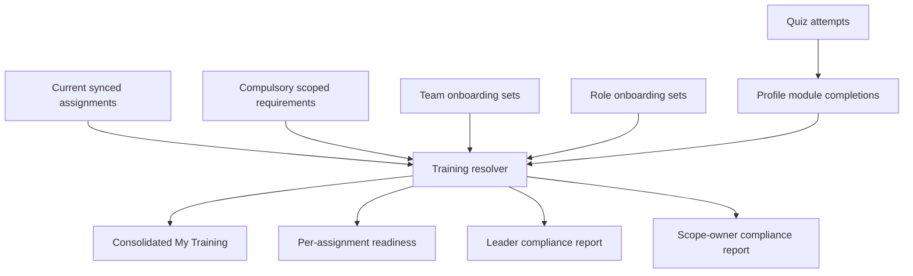

# feat: Training Onboarding and Compliance

## Summary

Add Training as an app-native feature for post-placement volunteer onboarding and compliance. The implementation will introduce reusable modules, scoped requirements, team and role onboarding sets, learner completions, quiz attempts, assignment-derived readiness, and member/leader/admin UI surfaces.

---

## Problem Frame

My Team already treats PCO/Rock as the source of truth for teams, positions, leaders, and assignments, while app-native features add development workflows that upstream systems do not provide. Training needs to follow that split: current assignments determine who needs training, while My Team owns module content, completion, expiry, and reporting.

The first version must deliver three pillars together: volunteers can complete training, leaders can see compliance, and scope owners can configure layered requirements.

---

## Requirements

**Training Content and Requirements**

- R1. The app must store reusable training modules that support text, video/link resources, activity prompts, Guide reuse, and quiz configuration.
- R2. The app must support central modules for church-wide, purpose, campus, and purpose-campus scopes, plus team-local modules created by team leaders.
- R3. Scope owners must manage both modules and compulsory requirements for the scopes they own.
- R4. Team leaders must define default team onboarding and role-specific onboarding for teams they lead.

**Assignment-Derived Compliance**

- R5. The app must derive applicable training from current synced assignments rather than manual person-to-training assignment.
- R6. The member experience must include both consolidated My Training and per-assignment compliance views.
- R7. Completion must be tracked per profile and module so valid completion carries across teams and roles.
- R8. Module expiry and blocking behavior must determine whether an assignment is compliant.

**Quiz and Version Behavior**

- R9. Modules with quizzes must support practice and passing-score completion rules.
- R10. Learners must be able to retake quizzes without losing an existing valid completion after a failed voluntary retake.
- R11. Published module edits must force the author to choose whether existing completions remain valid or require re-completion.

**Reporting and Access**

- R12. Team leaders must see compliance state for members in teams they lead.
- R13. Scope owners must see compliance gaps for required training in their scopes.
- R14. All new UI strings must use `next-intl` messages across every locale file.

---

## Key Technical Decisions

- **KTD1. Derive readiness at query time first.** Store modules, requirements, onboarding links, completions, and attempts, then compute current compliance from current assignments in API queries so upstream assignment changes are reflected without reconciliation jobs.
- **KTD2. Keep Training content separate from Guides.** Modules can reference Guides, but Training owns completion, expiry, quiz rules, and version invalidation so Guides remain a reference knowledge base.
- **KTD3. Model requirements as scoped links to modules.** Compulsory requirements and team/role onboarding should point at reusable modules rather than copying content, preserving shared completion and deduplication.
- **KTD4. Use profile-based completion ownership.** Existing app-native Goals and Feedback use `Profile`; Training completion should also attach to `Profile` while resolving current assignments through linked `Person` identities.
- **KTD5. Add tests alongside the first Training APIs.** The repo currently has no visible test harness, so the implementation should introduce a focused API/domain test setup instead of relying only on type-checking.

---

## High-Level Technical Design

The resolver is the central planning concept: it gathers a profile's current assignments, resolves all applicable requirement sources, deduplicates modules, applies completion validity, and emits both module-level and assignment-level compliance states.

---

## Implementation Units

### U1. Training Data Model and Migration

**Goal:** Add the app-native Training data model needed for modules, scoped requirements, onboarding sets, completions, versions, and quiz attempts.

**Requirements:** R1, R2, R3, R4, R7, R8, R9, R10, R11

**Dependencies:** None

**Files:**

- `packages/api/prisma/schema.prisma`
- `packages/api/prisma/migrations/<timestamp>_add_training/migration.sql`
- `packages/api/src/lib/training/types.ts`
- `packages/api/src/lib/training/validity.ts`
- `packages/api/src/lib/training/validity.test.ts`

**Approach:** Add app-native models after Guides and before preferences. Use nullable foreign keys and `SetNull` where preserving historical author/completion records matters, and `Cascade` only for child records that are meaningless without their parent module or attempt. Include enums for module scope, content type, completion mode, expiry behavior, module status, requirement source, and compliance status.

**Patterns to follow:** `Goal`, `Feedback`, and `Guide` in `packages/api/prisma/schema.prisma`; Prisma 7 generated client guidance in `docs/solutions/integration-issues/turborepo-prisma7-monorepo-setup.md`.

**Test scenarios:**

- A never-expiring completion remains valid for readiness.
- Covers AE2. A blocking expired completion returns a non-compliant state.
- Covers AE3. A non-blocking expired completion returns a renewal-needed state without blocking readiness.
- Covers AE5. A module version requiring re-completion invalidates older completions.

**Verification:** Prisma generate succeeds, migration applies to a development database, and validity tests cover expiry and version invalidation rules.

### U2. Training Resolver and tRPC Router

**Goal:** Provide API procedures for module management, onboarding assembly, member training, quiz attempts, and compliance reports.

**Requirements:** R1, R3, R4, R5, R6, R7, R8, R9, R10, R11, R12, R13

**Dependencies:** U1

**Files:**

- `packages/api/src/routers/training.ts`
- `packages/api/src/routers/_app.ts`
- `packages/api/src/lib/training/resolve.ts`
- `packages/api/src/lib/training/permissions.ts`
- `packages/api/src/lib/training/quiz.ts`
- `packages/api/src/lib/training/resolve.test.ts`
- `packages/api/src/lib/training/quiz.test.ts`

**Approach:** Add a `training` router with protected member queries and leader/admin mutations. Keep business logic in `packages/api/src/lib/training/` so resolver behavior can be tested without React. Start with team leader permissions and a minimal system-admin/scope-owner model; if no central admin assignment data exists yet, expose explicit app-native training admin records rather than hardcoding all authenticated users as admins.

**Patterns to follow:** `packages/api/src/routers/guides.ts` for leader-gated mutations and transactions; `packages/api/src/init.ts` for `protectedProcedure` and `leaderProcedure`; `packages/api/src/routers/teams.ts` for resolving assignments and display identities.

**Test scenarios:**

- Covers AE1. A completed shared module appears complete in two assignment contexts.
- A member with no current assignments receives an empty My Training response.
- A role checklist combines compulsory, team-level, and role-level modules without duplicates.
- A non-leader cannot mutate team onboarding for a team they do not lead.
- Covers AE4. A failed retake after a passing attempt records the attempt but does not unset the completion.

**Verification:** Router types compile, resolver tests cover assignment-derived readiness, and permission checks reject unauthorized mutations.

### U3. API Test Harness

**Goal:** Introduce a focused automated test setup for API domain logic and keep it small enough for the repo to maintain.

**Requirements:** Supports R5, R7, R8, R9, R10, R11, R12

**Dependencies:** U1

**Files:**

- `packages/api/package.json`
- `packages/api/vitest.config.ts`
- `packages/api/src/test/factories.ts`
- `package.json`
- `turbo.json`

**Approach:** Add Vitest for pure domain tests in `packages/api/src/lib/training/`. Avoid full database integration tests in the first pass unless implementation shows the resolver cannot be tested responsibly without a database-backed harness.

**Patterns to follow:** Existing package scripts in `apps/web/package.json` and `packages/api/package.json`; Turbo task style in `turbo.json`.

**Test scenarios:**

- Test expectation: no product behavior by itself; this unit is complete when U1 and U2 tests can run through the package script.

**Verification:** `pnpm --filter @mt/api test` runs the new training domain tests, and root `pnpm test` or Turbo test wiring is available if added.

### U4. Member Training Experience

**Goal:** Add the member-facing Training navigation and pages for consolidated My Training and per-assignment compliance.

**Requirements:** R5, R6, R7, R8, R9, R10, R14

**Dependencies:** U2

**Files:**

- `apps/web/src/components/layout/nav-items.ts`
- `apps/web/src/app/(app)/training/page.tsx`
- `apps/web/src/app/(app)/training/training-content.tsx`
- `apps/web/src/app/(app)/training/loading.tsx`
- `apps/web/src/app/(app)/training/[moduleId]/page.tsx`
- `apps/web/src/app/(app)/training/[moduleId]/training-module-content.tsx`
- `apps/web/src/components/training/training-checklist.tsx`
- `apps/web/src/components/training/training-module-card.tsx`
- `apps/web/src/components/training/quiz-form.tsx`
- `apps/web/messages/en.json`
- `apps/web/messages/zh-CN.json`
- `apps/web/messages/zh-TW.json`
- `apps/web/messages/mi.json`
- `apps/web/messages/sm.json`
- `apps/web/messages/hi.json`
- `apps/web/messages/ko.json`
- `apps/web/messages/to.json`
- `apps/web/messages/tl.json`
- `apps/web/messages/ja.json`

**Approach:** Follow the existing server prefetch plus client content pattern. The main page should show overall progress and per-assignment readiness without exposing administrative scope layering. The module page should render module content, Guide references, activity prompts, and quizzes, then update completion or attempt state through tRPC mutations.

**Patterns to follow:** `apps/web/src/app/(app)/goals/page.tsx`, `apps/web/src/app/(app)/goals/goals-content.tsx`, `apps/web/src/app/(app)/guides/[guideId]/guide-detail-content.tsx`, `apps/web/src/components/ui/card.tsx`, `apps/web/src/components/ui/progress-bar.tsx`, and `docs/solutions/integration-issues/trpc-v11-server-components-hydration.md`.

**Test scenarios:**

- Covers AE1. A shared completed module appears once in the consolidated list and complete in each relevant assignment.
- Covers AE2. A blocking expired module shows the affected assignment as not ready.
- Covers AE3. A non-blocking expired module shows renewal needed without removing ready status.
- Covers AE4. A learner can retake a quiz after passing, and a failed retake does not change the visible completed state.

**Verification:** The Training nav item routes correctly, pages hydrate without loading flashes, and all new strings are translated in every locale file.

### U5. Team Leader Training Management and Reporting

**Goal:** Let team leaders manage team/role onboarding and see compliance for teams they lead.

**Requirements:** R2, R4, R5, R8, R12, R14

**Dependencies:** U2, U4

**Files:**

- `apps/web/src/app/(app)/teams/[teamId]/training/page.tsx`
- `apps/web/src/app/(app)/teams/[teamId]/training/team-training-content.tsx`
- `apps/web/src/app/(app)/teams/[teamId]/training/loading.tsx`
- `apps/web/src/components/training/team-onboarding-editor.tsx`
- `apps/web/src/components/training/role-onboarding-editor.tsx`
- `apps/web/src/components/training/compliance-table.tsx`
- `apps/web/src/app/(app)/teams/[teamId]/team-view-content.tsx`
- `apps/web/messages/en.json`
- all non-English locale files in `apps/web/messages/`

**Approach:** Add a Training entry point from team pages for leaders. Use compact work-focused UI: module picker, team default set, role-specific set, and a compliance table showing ready, incomplete, expired, and blocked states for current members.

**Patterns to follow:** Team tab/action patterns in `apps/web/src/app/(app)/teams/[teamId]/team-view-content.tsx`; guide section management in `apps/web/src/components/guides/team-guide-sections.tsx`; leader-gated routes under `apps/web/src/app/(app)/teams/[teamId]/guides/new/`.

**Test scenarios:**

- A leader can add a central module to team default onboarding and see it apply to current team members.
- A leader can add a team-local module to one role and see only that role's members receive it.
- A non-leader who navigates to team training management is redirected or shown an access-denied state.
- The compliance table distinguishes ready, incomplete, expired, and blocked rows.

**Verification:** Leader workflows work from a team page, non-leaders cannot edit onboarding, and UI stays usable at mobile and desktop widths.

### U6. Central Training Administration

**Goal:** Provide the first administration surface for central modules, scope owners, and compulsory requirements.

**Requirements:** R1, R2, R3, R8, R11, R13, R14

**Dependencies:** U2, U4

**Files:**

- `apps/web/src/app/(app)/admin/training/page.tsx`
- `apps/web/src/app/(app)/admin/training/admin-training-content.tsx`
- `apps/web/src/app/(app)/admin/training/loading.tsx`
- `apps/web/src/components/training/module-editor.tsx`
- `apps/web/src/components/training/scope-requirement-editor.tsx`
- `apps/web/src/components/training/scope-owner-editor.tsx`
- `apps/web/src/components/training/scope-compliance-summary.tsx`
- `apps/web/messages/en.json`
- all non-English locale files in `apps/web/messages/`

**Approach:** Start with one administration area for module library management, owner assignment, compulsory requirements, and scope compliance. Keep the scope model explicit enough for church-wide, purpose, campus, and purpose-campus requirements, even if the available source data for purpose/campus needs a minimal app-native vocabulary in v1.

**Patterns to follow:** Guide editor patterns in `apps/web/src/app/(app)/teams/[teamId]/guides/new/guide-create-content.tsx`; shared form controls and cards in `apps/web/src/components/ui/`.

**Test scenarios:**

- A scope owner can create or edit a module in a scope they own.
- A scope owner can mark a module compulsory and see it included in matching assignment readiness.
- A user without scope ownership cannot access the central administration surface.
- Covers AE5. Editing a published module requires choosing completion validity impact.

**Verification:** Central admins can configure compulsory training end to end, and unauthorized users cannot mutate central training configuration.

### U7. Polish, I18n, and Integration Verification

**Goal:** Finish the feature as a coherent product area with complete localization, empty states, loading states, and regression checks.

**Requirements:** R6, R12, R13, R14

**Dependencies:** U4, U5, U6

**Files:**

- `apps/web/messages/en.json`
- all non-English locale files in `apps/web/messages/`
- `apps/web/src/components/training/*`
- `docs/solutions/integration-issues/training-onboarding-compliance.md`

**Approach:** Audit every Training surface for translated strings, responsive layout, empty/error/loading states, and consistency with existing My Team UI. Add a short solution note if implementation uncovers reusable patterns or pitfalls around assignment-derived compliance.

**Patterns to follow:** Empty state guidance in `AGENTS.md`; current UI components under `apps/web/src/components/ui/`; localization setup in `docs/solutions/integration-issues/nextintl-cookie-based-i18n-no-url-routing.md`.

**Test scenarios:**

- All Training routes render translated labels from message files.
- Empty member training, empty leader reports, and empty admin module libraries show useful empty states.
- Type-check catches missing translation keys or router type drift.

**Verification:** `pnpm lint`, `pnpm type-check`, `pnpm --filter @mt/api test`, and `pnpm build` pass after the full feature is implemented.

---

## Scope Boundaries

### In Scope

- App-native Training models and APIs.
- Member My Training and module completion flows.
- Team leader onboarding setup and compliance reporting.
- Central administration for modules, scope ownership, and compulsory requirements.
- Quiz attempts, passing rules, expiry, blocking status, and content-version invalidation.

### Deferred to Follow-Up Work

- Rich analytics beyond readiness and compliance reporting.
- Leader sign-off workflows.
- Manual assignment of training to people outside current synced assignments.
- Notifications for expired or incomplete training.
- Bulk import/export of training modules.

### Outside Product Identity for v1

- Recruiting or pre-placement volunteer pipelines.
- Replacing Guides as the reference knowledge base.
- Managing team membership inside My Team.

---

## System-Wide Impact

- **Data lifecycle:** Training adds persistent app-native records that must preserve useful history even when synced people or assignments change upstream.
- **Authorization:** Team leader permissions are already established, but scope ownership and system administration need a new app-native permission surface.
- **Navigation:** Training becomes a first-class app area and likely adds an administration entry point for authorized users.
- **Internationalization:** The feature introduces many strings across member, leader, and admin flows; all locale files must be updated together.
- **Testing posture:** This feature should establish a small API test foundation because assignment-derived readiness has stateful edge cases.

---

## Risks and Dependencies

- **Purpose and campus source data may be incomplete.** If synced data does not expose purpose/campus clearly enough, v1 should add an app-native vocabulary for training scopes and defer deeper upstream mapping.
- **Admin permissions are not yet modeled.** The plan assumes new app-native training administration records rather than overloading leader status for central scopes.
- **Resolver complexity can grow quickly.** Keep readiness calculation in one domain module so member, leader, and admin surfaces use the same compliance rules.
- **No existing test harness is visible.** U3 must stay focused and unblock Training domain tests without forcing a broad repo-wide testing redesign.

---

## Sources and Research

- `docs/brainstorms/2026-06-24-training-onboarding-compliance-requirements.md` - origin requirements and acceptance examples.
- `AGENTS.md` - app architecture, Prisma, i18n, and UI constraints.
- `packages/api/prisma/schema.prisma` - current synced and app-native model patterns.
- `packages/api/src/init.ts` - auth context, protected procedure, and leader procedure patterns.
- `packages/api/src/routers/guides.ts` - leader-gated CRUD, guide content, asset upload, and ordering patterns.
- `packages/api/src/routers/teams.ts` - assignment, leader, schedule, and display identity resolution patterns.
- `apps/web/src/app/(app)/goals/goals-content.tsx` - client content pattern for segmented app pages.
- `apps/web/src/app/(app)/guides/guides-list-content.tsx` - guide list and empty state patterns.
- `docs/solutions/integration-issues/trpc-v11-server-components-hydration.md` - tRPC v11 prefetch and invalidation pattern.
- `docs/solutions/integration-issues/turborepo-prisma7-monorepo-setup.md` - Prisma 7 and app-native data lifecycle guidance.
