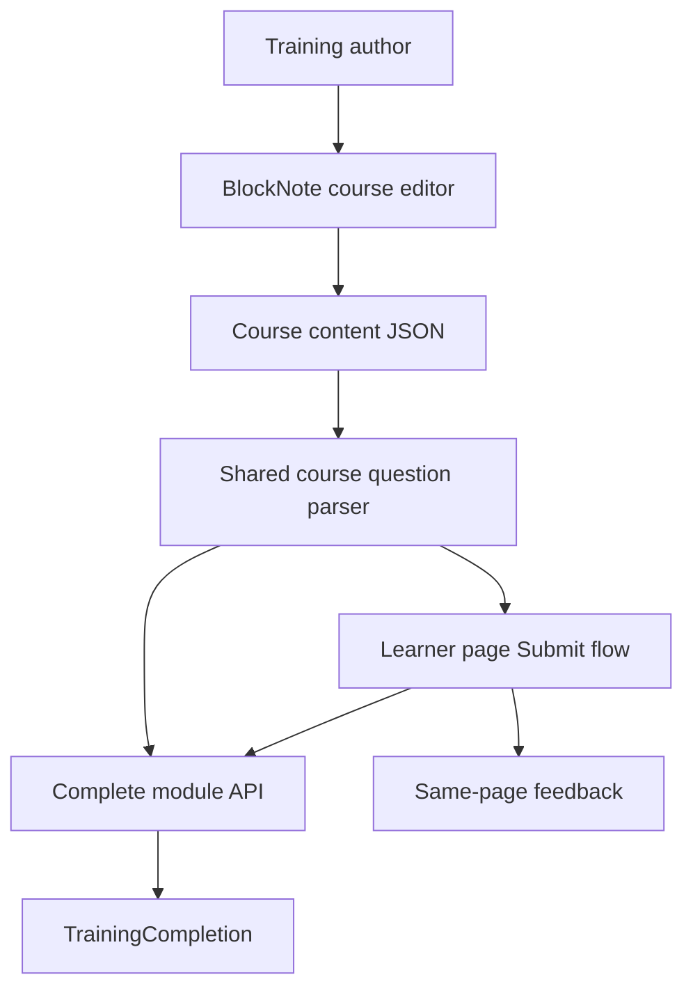
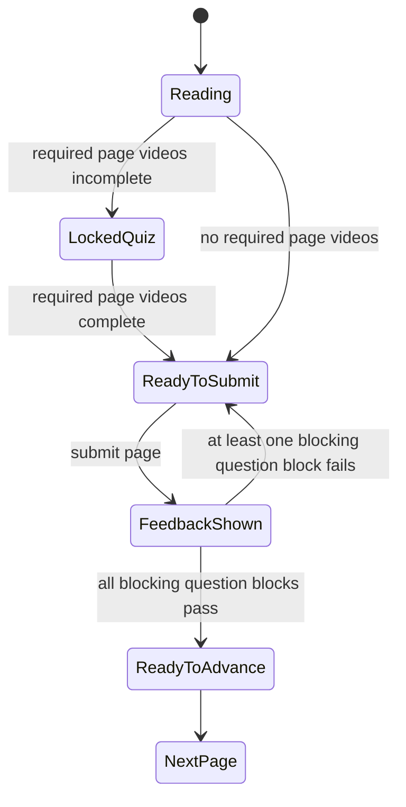

# feat: Course Builder Question Block

## Summary

Add a one-question question block to BlockNote course pages, with authoring controls, learner page Submit grading, same-page feedback, and server-side completion validation. Quiz blocks live inside course content, while the durable learner record remains the existing module completion state.

---

## Problem Frame

Training course pages already support rich page content and required video checkpoints, but knowledge checks are still either absent from the BlockNote course builder or represented by an older module-level quiz model. Authors need question blocks close to the material they test, and learners need page-level feedback before moving forward.

---

## Requirements

**Course Question Authoring**

- R1. The course builder must support a question block that contains exactly one question.
- R2. Authors must be able to add multiple question blocks to a page or course.
- R3. Authors must be able to configure single-answer or multi-answer mode.
- R4. Authors must be able to create, edit, remove, and mark correct answer options.
- R5. Authors must be able to configure progress behavior per question block, defaulting to block-until-correct.
- R6. Draft persistence must preserve question block content and settings.

**Learner Page Flow**

- R7. A course page with question blocks must use a Submit action before next-page navigation.
- R8. Submitting a question page must grade all question blocks on that page together.
- R9. Feedback must appear on the same page and reveal correct answers only after Submit.
- R10. Single-answer questions must accept one selection.
- R11. Multi-answer questions must accept multiple selections and require exact match to pass.
- R12. Multi-answer feedback must distinguish correct selections from wrong selections.
- R13. Blocking question blocks must keep the learner on the page until all blocking question blocks on that page pass.
- R14. Non-blocking question blocks must provide feedback without blocking progress solely because of that block.
- R15. Quiz interaction on a page with required videos must stay locked until the page's required videos are complete.

**Completion and Persistence**

- R16. Module completion must verify required course question answers on the server before writing a completion.
- R17. Course quiz answers must not be persisted as learner history in v1; only module completion is saved when the learner passes the module.
- R18. The older module-level quiz path must remain compatible for existing modules.
- R19. New and changed UI strings must be translated in every locale file.

---

## Key Technical Decisions

- **KTD1. Store question blocks in course content JSON.** The question block belongs to the page content flow, so its question, options, answer mode, and progress behavior should be part of the BlockNote course document rather than the existing module-level `quiz` field.
- **KTD2. Add shared course question parsing and evaluation.** API completion logic and learner UI should use the same normalized quiz shape so grading rules do not drift.
- **KTD3. Save only pass and completion state for course questionzes.** Course quiz answers are transient training-session data in v1; passing required question blocks allows the API to save module completion.
- **KTD4. Validate completion server-side, guide navigation client-side.** The client can manage page Submit state and video locking, but the API must reject completion when required blocking question blocks are unanswered or incorrect.
- **KTD5. Preserve module-level quiz compatibility.** Existing `quiz`, `completionMode`, and simple answer submission behavior should continue to work while course question blocks become the preferred page-level authoring model.
- **KTD6. Keep video gating page-level in v1.** Required videos only gate question interaction within the page experience; this plan does not add per-quiz video dependencies or persistent watch-proof beyond the current Training player behavior.

---

## High-Level Technical Design

Quiz data has one source of truth: course content. The learner UI uses it for interaction and feedback, and the API uses it to validate whether module completion can be saved.

Page answer state stays local to the learner view. Completion remains server-owned so a learner cannot complete a blocking quiz course by bypassing the UI, but course question answers are not retained after completion in v1.

---

## Scope Boundaries

- Multi-question question blocks are outside this plan; authors add multiple question blocks instead.
- Per-question-block video dependencies are outside this plan.
- Partial-credit scoring is outside this plan.
- Quiz analytics dashboards are outside this plan.
- A broad course builder redesign is outside this plan.

---

## Implementation Units

### U1. Shared Course Question Model and Evaluation

**Goal:** Define the normalized course question shape and grading rules used by both API and web code.

**Requirements:** R1, R3, R5, R8, R10, R11, R12, R13, R14, R16, R17, R18

**Dependencies:** None

**Files:**

- `packages/api/src/lib/training/course-content.ts`
- `packages/api/src/lib/training/course-content.test.ts`
- `packages/api/src/routers/training.ts`
- `apps/web/src/app/(app)/training/[moduleId]/training-module-content.tsx`

**Approach:** Add parser helpers for `blocknoteCourse` content that collect question blocks by page and normalize each question block into one question with options, answer mode, correct option IDs, and progress behavior. Add evaluation helpers that grade single-answer and multi-answer submissions, treat multi-answer pass as exact match, and report per-option feedback. Keep parsing permissive enough to ignore malformed question blocks while validation rejects completion when a blocking question block cannot be graded.

**Patterns to follow:** `packages/api/src/lib/training/validity.ts` and `packages/api/src/lib/training/resolve.ts` for pure domain helpers; `apps/web/src/app/(app)/training/[moduleId]/training-module-content.tsx` for existing course parsing behavior.

**Test scenarios:**

- A single-answer quiz passes only when the selected option is the correct option.
- A multi-answer quiz passes only when selected option IDs exactly match all correct option IDs.
- A multi-answer quiz returns feedback for correct selections, missed correct options, and wrong selections.
- A malformed or empty question block does not crash parsing.
- A blocking question block with no valid correct option prevents completion validation from silently passing.

**Verification:** `pnpm --filter @mt/api test` covers course question parsing and evaluation.

### U2. BlockNote Question Block Authoring

**Goal:** Add a custom BlockNote question block to the course builder with one-question authoring controls.

**Requirements:** R1, R2, R3, R4, R5, R6, R19

**Dependencies:** U1

**Files:**

- `apps/web/src/app/(app)/teams/[teamId]/training/course/new/block-note-course-editor.tsx`
- `apps/web/src/app/(app)/teams/[teamId]/training/course/new/course-create-content.tsx`
- `apps/web/messages/en.json`
- `apps/web/messages/zh-CN.json`
- `apps/web/messages/zh-TW.json`
- `apps/web/messages/mi.json`
- `apps/web/messages/sm.json`
- `apps/web/messages/hi.json`
- `apps/web/messages/ko.json`
- `apps/web/messages/to.json`
- `apps/web/messages/tl.json`
- `apps/web/messages/ja.json`

**Approach:** Extend the existing BlockNote schema with a `quiz` custom block. Store the prompt, answer mode, progress behavior, and answer options in block props so drafts and saved course content retain the block. Add block inspector controls for prompt, single versus multiple answer mode, answer option editing, correct markings, and progress behavior. Remove or avoid the older multi-question quiz editor affordance in this course-builder path so one block remains one question.

**Patterns to follow:** The custom video block in `apps/web/src/app/(app)/teams/[teamId]/training/course/new/block-note-course-editor.tsx`; block inspector update flow in `apps/web/src/app/(app)/teams/[teamId]/training/course/new/course-create-content.tsx`; i18n rules in `AGENTS.md`.

**Test scenarios:**

- Creating a question block starts with one prompt, two answer options, single-answer mode, and block-until-correct progress behavior.
- Switching from multi-answer back to single-answer leaves exactly one correct option.
- Removing options is prevented when only two options remain.
- Draft save and restore preserve prompt, options, answer mode, correct markings, and progress behavior.
- Publishing a course persists question block content in the module's course JSON.

**Verification:** Course builder type-checks, draft restoration handles question blocks, and all new strings exist in every locale file.

### U3. Learner Page Submit and Feedback Flow

**Goal:** Render question blocks in course pages and implement page-level Submit behavior before navigation.

**Requirements:** R7, R8, R9, R10, R11, R12, R13, R14, R15, R19

**Dependencies:** U1

**Files:**

- `apps/web/src/app/(app)/training/[moduleId]/training-module-content.tsx`
- `apps/web/messages/en.json`
- all non-English locale files in `apps/web/messages/`

**Approach:** Extend the course renderer to render `quiz` blocks as learner controls. Track answers and submitted feedback per page. If a page has question blocks, the forward action for that page becomes Submit; after Submit, show per-block feedback and allow correction. Permit navigation only when every blocking question block on the current page passes. Continue to lock question interaction when required videos on that page remain incomplete.

**Patterns to follow:** Existing page selection and required-video gating in `apps/web/src/app/(app)/training/[moduleId]/training-module-content.tsx`; existing UI components such as `Button`, `Card`, `Badge`, and `useToast`.

**Test scenarios:**

- A page without question blocks uses normal page navigation.
- A page with question blocks shows Submit instead of next-page navigation.
- Wrong blocking quiz answers reveal feedback and keep the learner on the page.
- Correcting all blocking quiz answers enables page advancement.
- A non-blocking question block reveals feedback without preventing advancement when other blocking question blocks pass.
- Required videos keep quiz controls locked until completion and do not reveal question details or answers while locked.

**Verification:** Manual browser verification covers mobile and desktop course pages with no quiz, one quiz, multiple question blocks, multi-answer questions, and required video gating.

### U4. Server Completion Validation

**Goal:** Ensure module completion honors course question block requirements without persisting course question answer history.

**Requirements:** R13, R14, R16, R17, R18

**Dependencies:** U1, U3

**Files:**

- `packages/api/src/routers/training.ts`
- `packages/api/src/lib/training/course-content.ts`
- `packages/api/src/lib/training/course-content.test.ts`
- `packages/api/src/lib/training/validity.test.ts`

**Approach:** Extend `completeModule` input to accept course question answers in addition to the existing module-level `quizAnswerId`. When a module contains `blocknoteCourse` question blocks, validate all blocking question blocks against submitted answers before upserting `TrainingCompletion`. Do not create `TrainingQuizAttempt` records for course question blocks in v1; the persisted learner state is only whether the module is complete. Preserve the existing module-level quiz path for modules that still use `module.quiz`.

**Patterns to follow:** Current `completeModule` quiz attempt creation in `packages/api/src/routers/training.ts`; existing `TrainingQuizAttempt` JSON storage in `packages/api/prisma/schema.prisma`; pure helper tests in `packages/api/src/lib/training/*.test.ts`.

**Test scenarios:**

- Completing a course with all blocking question blocks correct creates or updates `TrainingCompletion`.
- Completing a course with any blocking question block incorrect rejects completion without saving answer history.
- Completing a course with only non-blocking quiz failures can still save module completion.
- Existing module-level single-question quiz completion still works.
- Failed voluntary attempts do not remove an existing valid completion.

**Verification:** `pnpm --filter @mt/api test` passes with course question validation cases.

### U5. Course Creation Integration and Compatibility Cleanup

**Goal:** Wire question-bearing course creation into module metadata without breaking existing Training management paths.

**Requirements:** R2, R6, R16, R18, R19

**Dependencies:** U2, U4

**Files:**

- `apps/web/src/app/(app)/teams/[teamId]/training/course/new/course-create-content.tsx`
- `apps/web/src/app/(app)/teams/[teamId]/training/team-training-content.tsx`
- `packages/api/src/routers/training.ts`
- `apps/web/messages/en.json`
- all non-English locale files in `apps/web/messages/`

**Approach:** Ensure courses with question blocks publish with a completion mode that requires server validation at completion time. Keep the older training-management course builder or module-level quiz editor from producing conflicting multi-question question-block content for the new BlockNote course path. Where both authoring paths still exist, document compatibility in code comments only where needed and prefer the new course builder for page-embedded question blocks.

**Patterns to follow:** Existing `createTeamModule` mutation input handling; current course publish flow in `apps/web/src/app/(app)/teams/[teamId]/training/course/new/course-create-content.tsx`; existing management workspace compatibility in `apps/web/src/app/(app)/teams/[teamId]/training/team-training-content.tsx`.

**Test scenarios:**

- Publishing a course with question blocks creates a module that completion validation treats as question-bearing.
- Publishing a course without question blocks keeps acknowledge-style completion behavior.
- Older module-level quiz modules still render and complete through the existing path.
- Team and role onboarding assignment after course creation still works.

**Verification:** Type-check confirms mutation input changes flow through the tRPC client, and manual course creation covers both question-bearing and no-quiz courses.

### U6. End-to-End Verification and Polish

**Goal:** Verify the integrated authoring and learner experience against the brainstorm acceptance examples.

**Requirements:** R1-R19

**Dependencies:** U2, U3, U4, U5

**Files:**

- `docs/brainstorms/2026-06-28-course-builder-question-block-requirements.md`
- `apps/web/src/app/(app)/teams/[teamId]/training/course/new/course-create-content.tsx`
- `apps/web/src/app/(app)/training/[moduleId]/training-module-content.tsx`
- `packages/api/src/lib/training/course-content.test.ts`

**Approach:** Run focused automated tests for parsing, grading, and completion validation, then manually verify the course authoring and learner flows. Check that UI text fits in the existing Training visual language, especially quiz feedback cards, locked quiz states, and page Submit actions.

**Patterns to follow:** Existing Training UI density and card styling; frontend design and i18n guidance in `AGENTS.md`.

**Test scenarios:**

- Covers AE1. A wrong single-answer blocking question shows feedback, stays on the page, and allows retry.
- Covers AE2. A page with three blocking question blocks advances only after all three pass.
- Covers AE3. A multi-answer question with one correct and one wrong selection shows useful feedback and does not pass.
- Covers AE4. A required video locks quiz details until watched.
- Covers AE5. A non-blocking quiz gives feedback without blocking page advancement by itself.

**Verification:** `pnpm --filter @mt/api test`, `pnpm type-check`, `pnpm lint`, and browser verification of authoring plus learner flows.

---

## System-Wide Impact

- Course content JSON becomes a richer completion contract, so malformed question blocks need defensive parsing in both API and UI.
- Training completion remains profile-and-module based, but completion validation now depends on course content as well as module-level metadata.
- Course quiz answers remain transient; refresh or navigation can lose unsaved page answers unless the learner reaches module completion.
- The existing module-level quiz path must remain supported until older authoring surfaces are removed or migrated.
- Locale coverage expands in both `Training` and `TrainingAdmin` namespaces.

---

## Risks and Dependencies

- **BlockNote custom props can drift.** Mitigate with shared parsing helpers and tests that normalize the saved content shape.
- **Client-only video gating can be bypassed.** This plan preserves current page-level video behavior and server-validates quiz completion; persistent video watch proof is separate follow-up work.
- **No answer persistence limits resume behavior.** Mitigate by making the v1 product expectation clear: learners can resume completed modules, but in-progress quiz answers are not restored.
- **Two quiz concepts may confuse future maintainers.** Mitigate by keeping the old module-level quiz path compatibility-focused and naming course question helpers around course content.
- **Localized feedback text can get verbose.** Verify mobile layouts and button labels with the longest translated strings.

---

## Acceptance Examples

- AE1. **Single-answer blocking question**
  - **Covers:** R7, R9, R10, R13, R16
  - **Given:** A learner answers a blocking single-answer quiz incorrectly.
  - **When:** The learner submits the page.
  - **Then:** The page shows the correct answer, keeps the learner on the page, and lets the learner retry.

- AE2. **Multiple question blocks on one page**
  - **Covers:** R8, R13
  - **Given:** A page has three blocking question blocks.
  - **When:** The learner submits two correct answers and one incorrect answer.
  - **Then:** The learner stays on the page until all three blocking question blocks pass.

- AE3. **Multi-answer feedback**
  - **Covers:** R11, R12
  - **Given:** A multi-answer quiz has two correct options.
  - **When:** The learner selects one correct option and one wrong option.
  - **Then:** The attempt does not pass, and feedback identifies the correct and wrong selections.

- AE4. **Required video before quiz**
  - **Covers:** R15
  - **Given:** A page has a required video and a question block.
  - **When:** The learner has not completed the video.
  - **Then:** The quiz appears as a locked checkpoint without revealing question details or answers.

- AE5. **Older module-level quiz compatibility**
  - **Covers:** R18
  - **Given:** A published module uses the existing module-level quiz field.
  - **When:** The learner completes it through the current answer flow.
  - **Then:** Completion and attempt recording behave as they did before course question blocks.

- AE6. **Course quiz data is transient**
  - **Covers:** R17
  - **Given:** A learner answers course question blocks during a module session.
  - **When:** The learner passes the required question blocks and completes the module.
  - **Then:** The app saves module completion without storing the learner's course question answer history.

---

## Deferred Follow-Up Work

- Persisted video watch proof and server-side video completion enforcement.
- Persisted course question answer history, attempt review, and answer resume.
- Per-question-block video dependencies.
- Partial-credit scoring and scoring dashboards.
- Migration or removal of the older non-BlockNote course builder path.

---

## Sources and Research

- `docs/brainstorms/2026-06-28-course-builder-question-block-requirements.md` - origin requirements and acceptance examples.
- `docs/brainstorms/2026-06-24-training-onboarding-compliance-requirements.md` - Training completion, quiz, retake, and compliance context.
- `docs/plans/2026-06-24-001-feat-training-onboarding-compliance-plan.md` - prior Training implementation plan.
- `apps/web/src/app/(app)/teams/[teamId]/training/course/new/block-note-course-editor.tsx` - existing BlockNote schema and custom video block pattern.
- `apps/web/src/app/(app)/teams/[teamId]/training/course/new/course-create-content.tsx` - current course builder, block inspector, draft persistence, and publish flow.
- `apps/web/src/app/(app)/training/[moduleId]/training-module-content.tsx` - learner course rendering, page navigation, video gating, and module completion flow.
- `apps/web/src/app/(app)/teams/[teamId]/training/team-training-content.tsx` - older Training management course and quiz authoring context.
- `packages/api/src/routers/training.ts` - current module completion, module-level quiz validation, and attempt recording.
- `packages/api/src/lib/training/validity.ts` - existing pure domain helper pattern.
- `packages/api/src/lib/training/resolve.ts` - existing Training resolver pattern.
- `packages/api/prisma/schema.prisma` - current TrainingModule, TrainingCompletion, and TrainingQuizAttempt models.
