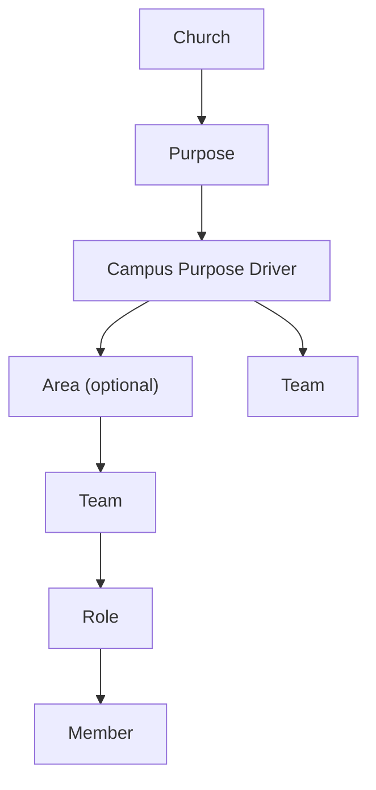
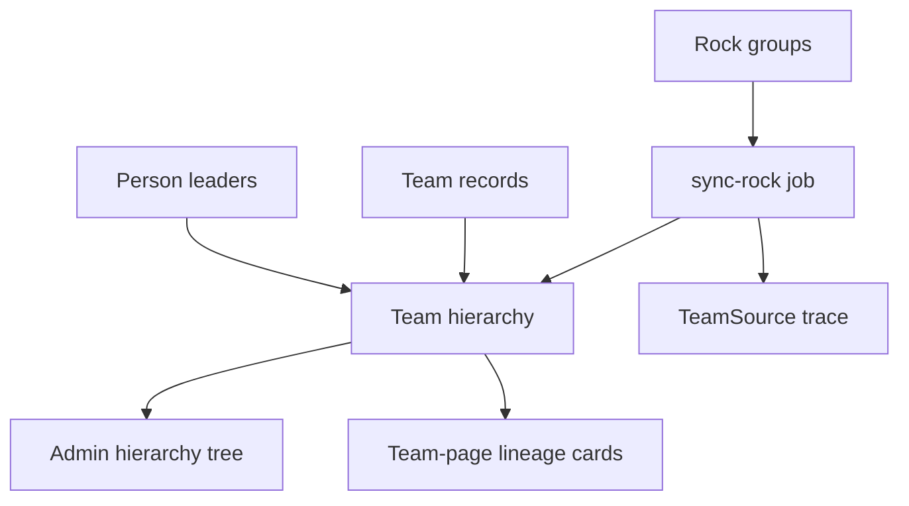

# Ministry Hierarchy - Plan

## Goal Capsule

- **Objective:** Add a first-class Ministry Structure experience that represents how the church is organized, gives Ministry administrators a place to manage the tree, and gives members trusted lineage context for their serving assignments.
- **Product authority:** The Ministry purpose owns hierarchy administration; members and team leaders are primary consumers of lineage and upstream leadership context.
- **Execution profile:** Build the Ministry Hierarchy foundation first: Team-based hierarchy fields, Rock sync mapping, read APIs, read-only admin tree, and team-page lineage cards. OKRs remain out of scope.
- **Stop conditions:** Stop and ask before adding editable hierarchy management, changing Rock/PCO source-of-truth behavior, or implementing OKRs.

---

## Product Contract

### Summary

My Team will model the church's ministry hierarchy as a visible product area rather than treating flat PCO teams as the foundation.
The hierarchy will support church, purpose, campus purpose driver, optional area, team, role, and member contexts so administrators can maintain the structure and later features can align work to the right leadership scope.

### Problem Frame

The current app is centered on PCO teams, but those teams are not the full ministry structure.
The church operates through purposes, purpose leaders, campus purpose drivers, optional area leaders, and team leaders.
Rock holds the richer structure through group types and parent group relationships, while PCO receives team data through a separate sync path.

Without a first-class hierarchy, the Ministry purpose lacks a dedicated administrative surface for keeping the tree accurate and bringing the right people into recruitment or leadership handoff workflows.
Members and team leaders also cannot easily see who leads above their team or how to trace leadership context up to the top.
Church and purpose leaders also lack a clean way to see activity across the real ministry structure.

The long-term direction is for My Team to replace much of the current external team and assignment management workflow.
Rock remains the current source of truth for a while, but the Ministry admin panel should be designed as the future place where the tree, team assignments, and related administrative workflows can be edited directly.

### Key Decisions

- **Hierarchy is a product experience.** Users should be able to browse and understand the ministry structure, not only encounter it as hidden metadata in filters.
- **Ministry administrators manage the tree.** V1 admin access should use a manually configured allowlist rather than deriving access from Ministry purpose leadership.
- **Rock is the structural authority.** Rock group types and parent relationships represent the ministry hierarchy; PCO should not be treated as the canonical hierarchy.
- **Source of truth changes over time.** V1 should treat Rock as authoritative, but the product direction is for My Team to eventually become the editable source of truth while Rock assignment data becomes read-only or downstream.
- **PCO teams are projections.** PCO team records should map back into the ministry structure rather than define it.
- **Team leaders should not maintain the full hierarchy.** The system should derive the hierarchy from upstream data as much as possible and reserve manual correction for trusted administrative workflows.
- **Areas are optional.** A team leader may report directly to a campus purpose driver when no area leader layer exists.
- **Nested Serving Team groups need product-level roles.** In PCO-shaped branches, top-level Serving Team nodes may represent a purpose-at-campus container, a repeated campus label, an actual team, or a role depending on their position.
- **Nested areas are allowed.** When a Rock Serving Team acts as a parent container under an Area, the product may normalize it as a nested Area rather than introducing a separate team-cluster concept.
- **Repeated campus labels fold into their parent scope.** In PCO-shaped branches, campus-label nodes such as `Central` should enrich the parent purpose-at-campus scope rather than appear as separate hierarchy levels.
- **Member lineage starts on team pages.** V1 should show members the leadership chain from the team page rather than adding hierarchy paths to profile or My Teams cards.
- **Admin starts with a browseable tree.** The first Ministry admin panel should present the hierarchy as a browseable read-only tree before adding health dashboards or mapping queues.
- **Admin tree stops at teams in v1.** Roles and members should remain available elsewhere for serving context, but the first admin tree should not expand below actual teams.
- **Team-page lineage uses team cards.** Each lineage step should render as a card with the team name, team kind, leaders, and quick contact actions.
- **Lineage includes the current team.** The team page lineage card stack should include the current team as the final card, not only the scopes above it.
- **Lineage reads top-down.** The team page lineage stack should start from the highest relevant scope and end with the current team.
- **Team-page lineage starts at Church.** Church is a real leadership scope and should appear in both the admin tree and member-facing team lineage.
- **Church is app-native.** The Church root should be a real Team row managed inside My Team, not a synthetic label derived from Rock.

### Actors

- A1. **Member** - serves in one or more teams and needs context for the structure above their assignment.
- A2. **Team leader** - leads a serving team and needs context, alignment, and reporting clarity.
- A3. **Area leader** - optionally oversees a set of teams within a purpose and campus context.
- A4. **Campus purpose driver** - leads a purpose at a specific campus and may directly oversee team leaders or area leaders.
- A5. **Purpose leader** - oversees a purpose across campuses.
- A6. **Church leader** - needs high-level visibility across purposes and campuses.
- A7. **Ministry administrator** - a manually authorized user who manages the hierarchy tree, source mappings, and administrative corrections.
- A8. **System administrator** - configures technical sync access and resolves system-level failures.

### Requirements

**Hierarchy Model**

- R1. The hierarchy must support church, purpose, campus purpose driver, optional area, team, role, and member contexts.
- R2. Rock Department groups must map to purpose-level hierarchy scopes.
- R3. Rock Locale groups must map to campus-purpose or driver-level hierarchy scopes.
- R4. Rock Area groups must map to optional area scopes.
- R5. Rock Serving Team groups must map to team scopes when they represent leaf serving teams.
- R6. A team must be able to belong under an area or directly under a campus purpose driver.
- R7. Roles and members must remain tied to current synced team and assignment data.
- R8. The hierarchy must preserve upstream source identity so Rock and PCO records can be traced.
- R9. The hierarchy must distinguish canonical ministry structure from provider-specific source records.
- R10. The product must account for Serving Team groups that are currently used as purpose-at-campus containers, repeated campus labels, actual teams, or team roles.
- R11. The hierarchy must support nested Area scopes when source data contains a parent container between an Area and actual teams.
- R12. Repeated campus-label source nodes must be folded into the parent purpose-at-campus scope for user-facing hierarchy.
- R13. The Church root must be represented as a real app-native My Team scope/team managed inside My Team.

**User Experience**

- R14. Members must be able to see where their serving assignment sits in the ministry structure.
- R15. Members must be able to identify the upstream leadership context for their assignment, including team leader, area leader when present, and campus purpose driver when no area layer exists.
- R16. Purpose, driver, area, and church leaders must be able to browse their relevant portion of the structure.
- R17. Members must be able to see the leadership chain above their team up to the top of the hierarchy.
- R18. Team leaders must be able to see the same lineage plus the teams and members they lead.
- R19. Structure views must make teams, roles, leaders, and members discoverable without making ordinary members or team leaders responsible for maintaining the tree.
- R20. The first member-facing lineage surface must be on the team page.
- R21. Team-page lineage must render each scope as a card with the team name and a sub-label for the team kind.
- R22. Team-page lineage cards must show the leaders for that scope.
- R23. Team-page lineage cards must provide call and email actions for listed leaders when contact details are available.
- R24. Team-page lineage must include the current team as the final scope card.
- R25. Team-page lineage must read top-down from the Church scope to the current team.

**Administration**

- R26. Ministry administrators must have an administrative panel for reviewing and managing the ministry tree.
- R27. Ministry administrators must be able to resolve source mapping issues that affect hierarchy placement.
- R28. Ministry administrators must be able to identify where people need to be brought into recruitment or leadership handoff processes at appropriate hierarchy points.
- R29. The administrative panel must be designed so future versions can edit teams, assignments, and hierarchy records directly in My Team.
- R30. The first implementation must keep Rock-owned records read-only and guide Ministry administrators to correct source data upstream.
- R31. The first implementation should still organize the admin panel so future editable management can replace upstream correction guidance later.
- R32. V1 Ministry admin access must be controlled by a manual allowlist.
- R33. The first Ministry admin panel surface must be a browseable read-only hierarchy tree.
- R34. The first admin tree must stop at actual teams rather than expanding into roles and members.

**Source Mapping and Trust**

- R35. The product must treat Rock as the current source of truth for Rock-derived hierarchy scopes unless later discovery identifies a narrower exception.
- R36. The product must support a staged transition where My Team can become the future source of truth for hierarchy and assignment management.
- R37. PCO teams must be mappable to the canonical hierarchy without making PCO the hierarchy authority.
- R38. The system must use Rock PCO marker metadata where available to trace PCO service type, team, and position relationships.
- R39. The system must surface unmapped or ambiguous source records to Ministry administrators instead of silently placing them in the wrong scope.
- R40. The hierarchy must be reusable by app-native features such as OKRs, Training, Guides, and Feedback.

### Structure View



### Key Flows

- F1. Member views assignment lineage
  - **Trigger:** A member opens a team, role, or ministry structure view for one of their assignments.
  - **Actors:** A1, A2
  - **Steps:** The member sees the assignment, team, purpose, campus driver, optional area, and leadership chain up to the top.
  - **Covered by:** R1, R6, R13, R14, R15, R17, R20, R21, R22, R23, R24, R25

- F2. Upper leader browses their scope
  - **Trigger:** A purpose, driver, area, or church leader opens the structure experience.
  - **Actors:** A3, A4, A5, A6
  - **Steps:** The leader sees the scopes they own and can drill down into lower scopes without editing source-owned data.
  - **Covered by:** R16, R19

- F3. Administrator resolves an ambiguous mapping
  - **Trigger:** Sync finds a Rock or PCO record that cannot be confidently mapped.
  - **Actors:** A7, A8
  - **Steps:** The administrator reviews the source record, selects the correct canonical scope, and preserves the source trace.
  - **Covered by:** R8, R9, R27, R39

- F4. Ministry administrator manages the tree
  - **Trigger:** The Ministry purpose needs to keep the structure accurate or bring the right people into a recruitment or handoff process.
  - **Actors:** A7
  - **Steps:** The administrator reviews the tree, checks source mappings, identifies missing or stale leadership points, and updates or flags the required correction.
  - **Covered by:** R26, R27, R28, R29, R30, R31, R32, R33, R34

### Rock Structure Findings

Rock represents the ministry structure with active group types and parent relationships:

| Rock group type ID | Rock name | Product meaning | Active groups observed |
|---:|---|---|---:|
| 38 | Department | Purpose or strata | 8 |
| 39 | Locale | Purpose/strata at a campus, used as the driver-level scope | 23 |
| 40 | Area | Optional subgroup under a Locale | 63 |
| 23 | Serving Team | Serving team or, in some branches, intermediate structure | 252 |

Serving Team ancestry is not uniform:

| Shape | Serving team count observed |
|---|---:|
| Department > Locale > Area > Serving Team | 121 |
| Department > Serving Team > Serving Team > Serving Team > Serving Team | 90 |
| Department > Serving Team > Serving Team > Serving Team | 26 |
| Department > Locale > Area > Serving Team > Serving Team | 8 |
| Department > Serving Team | 4 |
| Department > Serving Team > Serving Team | 3 |

The CT MAG-style nested shape should be interpreted product-wise as a PCO-shaped structural branch:

```text
Department
  Serving Team: purpose-at-campus container
    Serving Team: repeated campus label
      Serving Team: actual serving team
        Serving Team: team role or position
```

For example, `CT MAG > Central > Music > Acoustic Guitar` should not make all four nodes equal teams.
`CT MAG` behaves like a purpose-at-campus container created by the PCO sync shape, `Central` repeats the campus and should fold into `CT MAG`, `Music` is the actual serving team, and `Acoustic Guitar` is a team role.

The Ev Catering nested shape should be interpreted product-wise as nested areas under an existing Area:

```text
Department
  Locale
    Area: parent area
      Area: nested area normalized from a parent Serving Team
        Serving Team: actual team
```

For example, `M Support > ~HQ M SUP > Ev Catering > Catering Cooks > UC Dinner Makers Team 1` should map `Ev Catering` as an Area, `Catering Cooks` as a nested Area, and `UC Dinner Makers Team 1` as the actual serving team.

Leader roles exist for Department, Locale, Area, and Serving Team group types.
Observed leader assignments are concentrated in Locale, Area, and Serving Team groups; Department groups have sparse leader membership in the current data.
Rock campuses referenced by the configured team group types are North, Central, and Unichurch.

The Rock `PCOMarker` attribute on Serving Team groups stores PCO metadata, including service type, team, team position, name, and whether the source represents a PCO team leader or team position.
This should be used for source tracing and mapping, not treated as the ministry hierarchy itself.

### Acceptance Examples

- AE1. **Team without area**
  - **Covers:** R6, R12
  - **Given:** A team reports directly to a campus purpose driver.
  - **When:** The team leader views their context.
  - **Then:** The hierarchy shows the driver relationship without requiring an empty area layer.

- AE2. **PCO team mapped to Rock structure**
  - **Covers:** R9, R35, R37, R38
  - **Given:** A PCO team corresponds to a Rock team within a purpose and campus.
  - **When:** The team appears in My Team.
  - **Then:** The team appears under the canonical ministry scope and keeps its PCO source trace.

- AE3. **Ambiguous source record**
  - **Covers:** R39
  - **Given:** A synced source record could belong to more than one ministry scope.
  - **When:** Sync or mapping cannot resolve it confidently.
  - **Then:** The record is surfaced for administrative resolution rather than silently assigned.

- AE4. **Nested area normalized from Serving Team source**
  - **Covers:** R10, R11
  - **Given:** A Rock Serving Team under an Area contains child Serving Teams that are the actual rota teams.
  - **When:** The hierarchy is presented in My Team.
  - **Then:** The parent Serving Team is normalized as a nested Area and the child Serving Teams appear as actual teams.

- AE5. **Read-only administration with future editable path**
  - **Covers:** R29, R30, R31, R36
  - **Given:** Rock remains the current source of truth for assignments.
  - **When:** A Ministry administrator uses the first hierarchy admin panel.
  - **Then:** The interface guides them to correct source data upstream while organizing the workflow so future My Team editing can replace that guidance later.

### Success Criteria

- Members can understand the leadership lineage above their serving assignment without asking someone to explain the org chart.
- Team leaders can understand their team context and upstream leadership chain.
- Ministry administrators can manage and correct the tree from a dedicated administrative surface.
- The admin panel creates a path for My Team to become the future source of truth for team and assignment management.
- Upper leaders can browse the structure relevant to their leadership scope.
- PCO and Rock records can be traced back to their source while users interact with a canonical ministry structure.
- The hierarchy can serve as a shared scope model for OKRs and other app-native features.

### Scope Boundaries

- Building OKRs is outside this hierarchy plan, though the hierarchy must support them.
- General manual org-chart management by team leaders is outside scope.
- Replacing Rock as the structural source of truth is outside the first implementation, but the product should be shaped toward that future transition.
- Recruiting, placement, and membership management remain outside scope; current membership continues to come from upstream systems.

### Dependencies / Assumptions

- Rock contains the current ministry structure through Department, Locale, Area, and Serving Team group types.
- PCO teams are currently separate records in the app and may represent a projection copied from Rock into PCO.
- My Team is intended to become the future source of truth for team and assignment management, but that transition will happen after the initial hierarchy work.
- Existing synced team, position, leader, assignment, and profile records remain important inputs.
- The hierarchy should align with the scope vocabulary already used by Training: church, purpose, campus or purpose-campus, team, and role.

### Outstanding Questions

- What administrative workflow is needed for ambiguous mappings?
- How should sparse Department-level leader membership be interpreted in permissions and roll-ups?
- What does the staged migration from Rock-owned assignments to My Team-owned assignments look like after v1?

### Sources / Research

- `AGENTS.md` - confirms PCO/Rock-synced data is read-only from the app perspective and app-native features should build on synced context.
- `docs/plans/2026-05-25-001-feat-rock-pco-unified-sync-plan.md` - prior plan for unified Rock and PCO provider data.
- `docs/brainstorms/2026-06-24-training-onboarding-compliance-requirements.md` - existing product vocabulary for church, purpose, campus, team, and role scopes.
- `packages/api/prisma/schema.prisma` - current provider-scoped source records and app-native model boundaries.
- `packages/jobs/src/rock.ts` and `packages/jobs/src/sync-rock/job.ts` - current Rock sync maps groups into team-shaped records but does not yet expose a durable ministry hierarchy.
- Rock API read-only research on 2026-07-08 - confirmed group types 38, 39, 40, and 23; parent-group ancestry shapes; leader roles; campus references; and PCO marker metadata.

---

## Planning Contract

### Key Technical Decisions

- KTD1. **Make Team the canonical hierarchy node.** Add hierarchy fields to `Team`, including parent relationship, team kind, sort order, active state, and source trace records so Rock-derived structure can normalize into product semantics without a parallel scope model.
- KTD2. **Keep Church app-native.** Seed or upsert a single Church root Team managed inside My Team; Rock-derived hierarchy teams attach beneath it.
- KTD3. **Sync Rock groups into Teams during Rock sync.** Extend the existing Rock sync path to upsert Department, Locale, Area, and configured Serving Team groups as hierarchy Teams before team lineage is read.
- KTD4. **Classify source groups deterministically.** Use group type, ancestor shape, PCO marker metadata, and child relationships to classify source groups into Purpose, Driver, Area, Team, or Role Artifact. Fold repeated campus-label nodes into their parent driver scope.
- KTD5. **Expose read APIs first.** Add read-only API surfaces for the admin tree and team lineage; v1 must not write back to Rock or locally override Rock-derived records.
- KTD6. **Manual admin allowlist.** Use an app-native allowlist for the Ministry admin panel instead of deriving admin access from Ministry purpose leadership.

### High-Level Technical Design



The implementation should use `Team` as the canonical hierarchy layer while preserving existing `Position`, `Leader`, and `Assignment` behavior.
`Team` owns the product hierarchy via `parentTeamId` and `kind`.
`TeamSource` preserves provider source identities for Rock and PCO records that map to the same canonical Team.

### Scope Classification Rules

| Source shape | Product mapping |
|---|---|
| App-native root | Church |
| Rock Department | Purpose |
| Rock Locale | Campus purpose / driver |
| Rock Area | Area |
| Rock Serving Team under Area with child Serving Teams | Nested Area |
| Rock Serving Team under Department matching CT/NS/UC purpose-campus pattern | Campus purpose / driver |
| Repeated campus-label Serving Team such as `Central` | Fold into parent driver, no visible scope |
| Serving Team with child PCO-marked positions under PCO-shaped branch | Actual Team |
| PCO-marked child Serving Team representing team position or team leader | Role artifact, not a visible scope |
| Leaf Serving Team under Area or nested Area | Actual Team |

### System-Wide Impact

- Prisma schema changes require a migration and regenerated client.
- Rock sync changes affect provider-scoped data import and must remain conservative; no destructive hierarchy pruning beyond clearly source-owned scope rows in v1.
- Team detail responses gain lineage data consumed by the web team page.
- A new admin route must be protected by a manual allowlist and should not appear for ordinary users.
- Existing team, schedule, guide, feedback, training, and goal behavior should continue to work unchanged.

### Risks & Dependencies

- Rock group data uses the same `Serving Team` group type for multiple product meanings, so classifier tests need real representative fixtures.
- Existing synced data may not yet contain enough source fields to build the hierarchy unless Rock sync persists parent IDs and source metadata.
- Sparse Department leader membership means v1 should not rely on Department leaders for authorization.
- The first admin panel is read-only, so it must avoid implying edits are saved in My Team.

### Implementation Sequencing

1. Add schema and migration for Team hierarchy fields, source traces, and admin allowlist.
2. Add pure classifier/resolver coverage using representative Rock-shaped fixtures.
3. Extend Rock sync to populate the Team hierarchy tree and link PCO source identities to canonical Teams.
4. Add API queries for admin tree and team lineage.
5. Add web admin tree and team-page lineage UI.
6. Run focused API tests, type checks, lint, and browser smoke checks.

---

## Implementation Units

### U1. Ministry hierarchy schema foundation

- **Goal:** Add persistent canonical hierarchy models and generate the Prisma client.
- **Requirements:** R1-R13, R24-R40
- **Files:**
  - `packages/api/prisma/schema.prisma`
  - `packages/api/prisma/migrations/<timestamp>_add_ministry_hierarchy/migration.sql`
  - `CONCEPTS.md`
- **Approach:** Add `TeamKind`, hierarchy fields on `Team`, `TeamSource`, and `MinistryAdmin`. Include parent-child Team relationships, source provider/remote IDs, source group type metadata, and profile-based admin allowlist.
- **Test Scenarios:**
  - Prisma validates the new schema.
  - Generated client exposes the new hierarchy models.
  - Unique constraints prevent duplicate source mappings and duplicate admin allowlist rows.
- **Verification:** `pnpm --filter @mt/api exec prisma validate`; `pnpm --filter @mt/api exec prisma generate`.

### U2. Rock hierarchy classifier and sync mapping

- **Goal:** Convert Rock group shapes into canonical hierarchy Teams during sync.
- **Requirements:** R2-R12, R27-R31, AE1-AE4
- **Files:**
  - `packages/jobs/src/rock.ts`
  - `packages/jobs/src/sync-rock/job.ts`
  - `packages/jobs/src/rock-hierarchy.test.ts`
  - `packages/api/src/lib/ministry-hierarchy.ts`
  - `packages/api/src/lib/ministry-hierarchy.test.ts`
- **Approach:** Extract pure classification helpers for Department, Locale, Area, PCO-shaped Serving Team branches, nested Area branches, repeated campus labels, and role artifacts. Extend the Rock snapshot to include hierarchy Team upserts, TeamSource traces, and normal Team leader/member links. Keep the sync read-only with respect to upstream systems.
- **Test Scenarios:**
  - Department maps to Purpose and attaches under Church.
  - Locale maps to driver/campus-purpose under its Department.
  - Area maps under Locale.
  - `CT MAG > Central > Music > Acoustic Guitar` maps `CT MAG` to driver, folds `Central`, maps `Music` to team, and treats `Acoustic Guitar` as a role artifact.
  - `Ev Catering > Catering Cooks > UC Dinner Makers Team 1` maps `Catering Cooks` as a nested Area and the child as a team.
  - PCO marker metadata is retained as source trace data.
- **Verification:** `pnpm --filter @mt/api test`; any focused jobs-package test command available after discovery.

### U3. Hierarchy API queries and authorization

- **Goal:** Expose read-only hierarchy data for the admin tree and team-page lineage.
- **Requirements:** R14-R40, F1-F4, AE1-AE5
- **Files:**
  - `packages/api/src/routers/ministry-hierarchy.ts`
  - `packages/api/src/routers/teams.ts`
  - `packages/api/src/routers/_app.ts`
  - `packages/api/src/init.ts`
  - `packages/api/src/routers/ministry-hierarchy.test.ts`
- **Approach:** Add a hierarchy router with `adminTree` protected by the manual allowlist. Add a team lineage result to `teams.get` or a dedicated query consumed by team pages. Return team cards with name, kind label, leaders, source badges, and contact fields. Admin tree stops at actual teams in v1.
- **Test Scenarios:**
  - Non-admin users cannot access the admin tree.
  - Allowlisted admins can access the tree.
  - Team lineage includes Church and current team, reads top-down, and includes leaders/contact fields.
  - Repeated campus-label nodes do not appear as cards.
  - Admin tree stops at actual teams and does not expand into roles/members.
- **Verification:** `pnpm --filter @mt/api test`; `pnpm type-check`.

### U4. Team-page lineage cards

- **Goal:** Show member-facing hierarchy lineage on team pages.
- **Requirements:** R14-R25, F1
- **Files:**
  - `apps/web/src/app/(app)/teams/[teamId]/team-view-content.tsx`
  - `apps/web/src/components/teams/ministry-lineage-card.tsx`
  - `apps/web/messages/en.json`
- **Approach:** Add a lineage card stack near the team header or members tab using existing Card, Avatar/contact action, and responsive spacing patterns. Each card shows team name, team kind sub-label, leaders, and phone/email actions where available.
- **Test Scenarios:**
  - Team page renders the lineage stack when lineage data exists.
  - Church appears first and the current team appears last.
  - Missing leaders render a quiet empty leader state without layout shift.
  - Phone and email buttons use the existing `callPerson` and `emailPerson` translation pattern.
- **Verification:** `pnpm --filter @mt/web type-check`; browser smoke at `/teams/[teamId]` on desktop and mobile.

### U5. Ministry admin tree page

- **Goal:** Add a read-only admin page for allowlisted Ministry administrators.
- **Requirements:** R26-R40, F2-F4, AE2-AE5
- **Files:**
  - `apps/web/src/app/(app)/admin/ministry/page.tsx`
  - `apps/web/src/app/(app)/admin/ministry/ministry-admin-content.tsx`
  - `apps/web/src/components/layout/nav-items.ts`
  - `apps/web/messages/en.json`
- **Approach:** Add a quiet operational admin page that renders the hierarchy tree from Church to actual teams and stops there. Show source badges and read-only upstream correction guidance. Hide the nav item unless the current user is allowlisted or render a guarded route without nav exposure if nav gating is not yet available.
- **Test Scenarios:**
  - Allowlisted admin can load the page and browse the tree.
  - Non-admin user gets a forbidden/empty state.
  - The tree renders Church, Purpose, Driver, Area, nested Area, and Team nodes with source labels.
  - Roles and members do not render in the admin tree.
- **Verification:** `pnpm --filter @mt/web type-check`; browser smoke at `/admin/ministry` as an admin and as a non-admin if local data permits.

### U6. Verification and polish

- **Goal:** Verify the hierarchy implementation end-to-end and keep the UI consistent with the product.
- **Requirements:** All requirements and acceptance examples.
- **Files:**
  - `apps/web/messages/en.json`
  - Any changed test files from U1-U5
- **Approach:** Run focused tests first, then repo type-check and lint. Start the app on port 7500 and inspect the team page and admin tree at desktop/mobile widths. Fix obvious text overflow, empty states, and permission states.
- **Test Scenarios:**
  - Existing team pages still load.
  - New lineage data does not break teams without hierarchy mapping.
  - Admin page handles empty tree and forbidden states.
- **Verification:** `pnpm --filter @mt/api test`; `pnpm type-check`; `pnpm lint`; browser smoke with `pnpm dev:codex` or the established local dev command on `http://localhost:7500`.

---

## Verification Contract

| Gate | Command / Check | Applies To |
|---|---|---|
| Prisma validation | `pnpm --filter @mt/api exec prisma validate` | U1 |
| Prisma client generation | `pnpm --filter @mt/api exec prisma generate` | U1 |
| API tests | `pnpm --filter @mt/api test` | U2, U3 |
| Type checking | `pnpm type-check` | U3-U6 |
| Lint | `pnpm lint` | U4-U6 |
| Browser smoke | Start on `http://localhost:7500`; inspect team page lineage and admin tree at desktop and mobile widths | U4-U6 |

---

## Definition of Done

- The plan's Product Contract remains intact and the implementation does not add OKR behavior.
- Prisma schema and migration support canonical hierarchy Teams, source traces, and manual admin allowlist.
- Rock sync populates the Team hierarchy tree for the researched Rock group shapes without writing upstream.
- `teams.get` or an equivalent query returns top-down team lineage from Church through current team.
- Team pages render team cards with team kind, leaders, and contact actions.
- Allowlisted Ministry admins can view a read-only tree that stops at actual teams.
- Non-admin users cannot access the admin tree.
- Tests cover classifier behavior, authorization, admin tree shape, and team lineage shape.
- Verification Contract commands pass, or any unavailable browser/admin-data smoke check is explicitly reported.
- Dead-end experimental code and debug-only scripts are removed before finishing.
